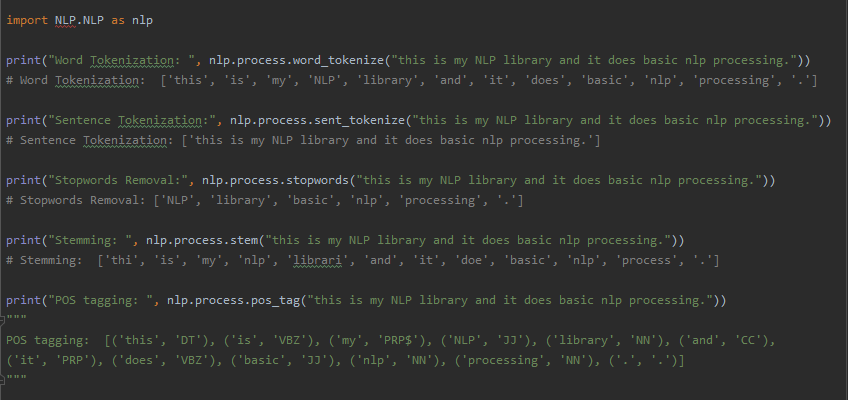
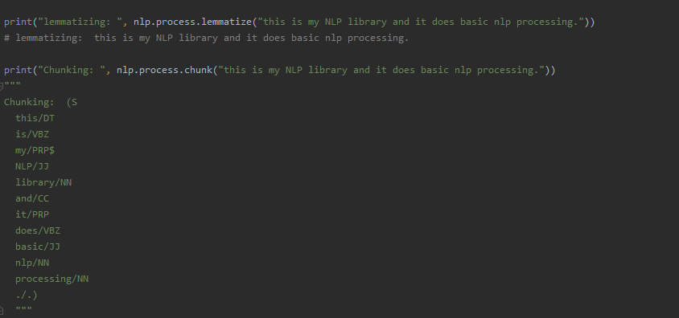

<h2>nlp-simple-library</h2>
<h4><i>This repository contains NLP library created for simple NLP tasks.<i></h4>
  
<b>main_file.py</b> file contains the usage of the library. All the library files are stored in <b>NLP</b> folder. 
 
<h2> Usage: </h2>
</img>
</img>

<h2> Further: </h2>

 Many other functions will be added in future

 Contributions are welcome... 

